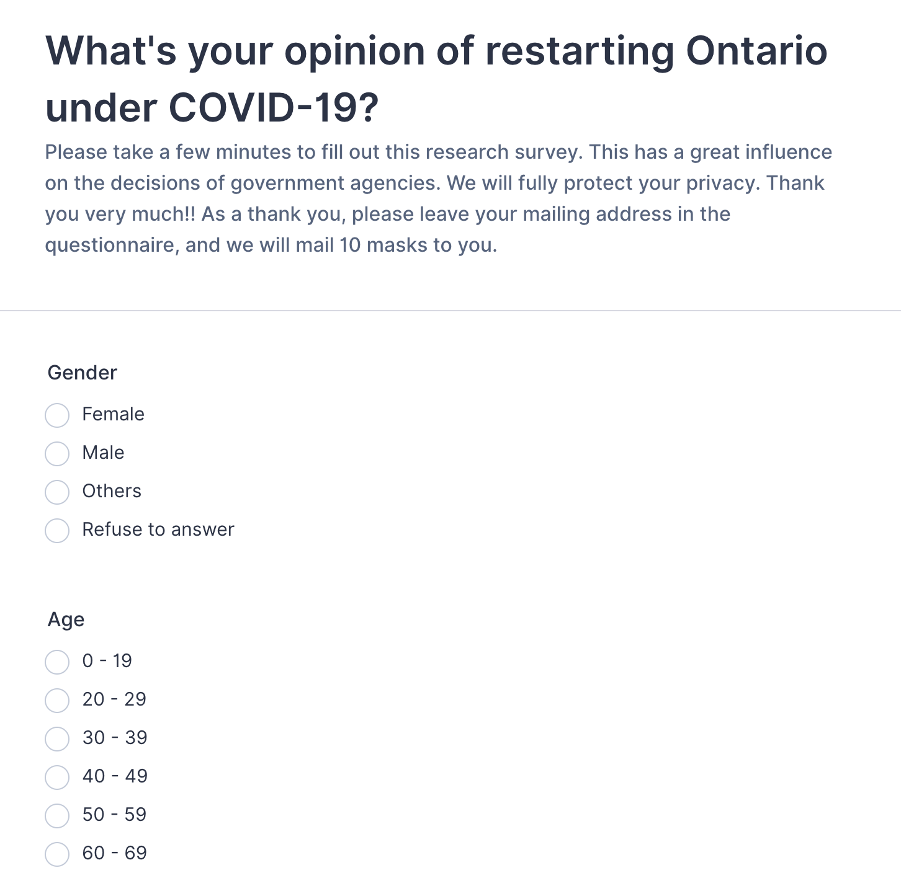
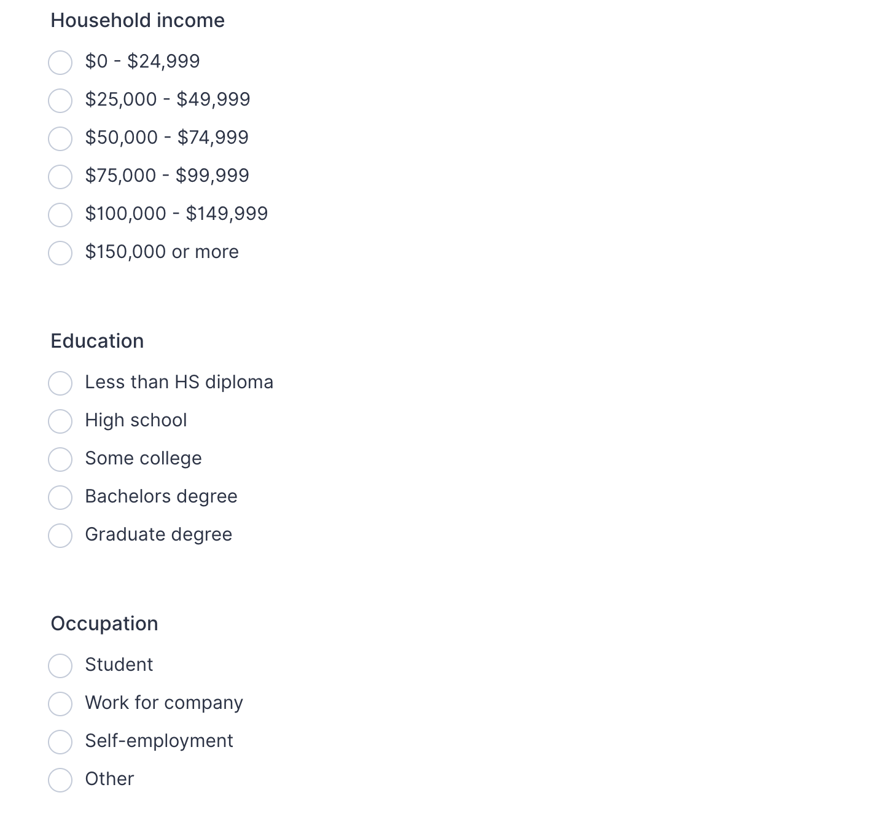

```{r setup, include=FALSE}
library(dplyr)
library(ggplot2)
knitr::opts_chunk$set(echo = TRUE)
```

# Summary

COVID-19 disease, caused by severe acute respiratory syndrome Coronavirus 2 [@of2020species], has had a huge impact on all aspects of our lives. 

In this survey, we are going to find out different age groups' opinions of Restarting Ontario's economy. The population is all registered residents in Ontario. One thousand samples will be taken and stratified sampling method is mainly considered according to the proportion of each age group. 

We will email the questionnaire to each selected person. To encourage respondents to answer the questionnaire, we are willing to send 10 masks once they submitted the questionnaire. In addition, if a person refuse or ignore to finish the questionnaire, we will seek one more respondent from his/her age group until we achieve enough samples. To those elder people who may not be familiar to email, we will use the hand-copy questionnaire. 

Respondents do not need to fill in any identifiable personal information, and we will also promise to protect the privacy of respondents in the questionnaire.

To be optimistic, we roughly need to contact at least 1,300 respondents in total. To each respondent, we need to pay for masks and postage that may cost about 7,000 to 8,000 dollars in total. 

# 1. Introduction

Our company will conduct a sample survey of the opinions of Ontario residents on the Restarting plan. Stratified random sampling will be used as the sampling method and our questionnaire will includes 7 multiple choice questions concerning the gender, age, income, occupation, education, and the specific opinion of Restarting. We will make analysis in terms of the relationship among the collected data and give some useful conclusions.

# 2. Survey Methodology

## 2.1 Survey Methods Theories

### (1) Simple Random Sampling Without Replacement

In simple random sampling without replacement(SRSWOR), each sample unit of the population has only one chance to be selected in the sample. For example, if one draws a simple random sample such that no unit occurs more than one time in the sample, the sample is drawn without replacement. 

Suppose we randomly select $n$ distinct units from the population of size $N$, then 

Probability of sample selection = $\frac{1}{\left(\begin{array}{l}N \\ n\end{array}\right)}$, where $\left(\begin{array}{l}N \\ n\end{array}\right) = \frac{N !}{(N-n) !}$

Sample Mean = $\bar{y}=\frac{1}{n} \sum_{i \in S} y_{i}$, which means sum all of the values of sample and then divided by the sample size.

### (2) Stratified Random Sampling

Stratified random sampling(SRS) is a method of sampling that involves the division of a population into smaller sub-groups known as strata [@lohr2009sampling]. In stratified random sampling, or stratification, the strata are formed based on members' shared attributes or characteristics such as income or educational attainment.

Assume there are $H$ (non-overlapping) strata, $h$ will represent a specific stratum, $h=1,2,...,H$

$N_{h}$ is the population size of the $h^{t h}$ stratum.
$$
N=\sum_{h=1}^{H} N_{h}
$$
$n_{h}$ is the sample size of the $h^{t h}$ stratum.
$$
n=\sum_{h=1}^{H} n_{h}
$$
$y_{h i}$ is value of the study variable $y$ for unit $i$ in stratum $h$.
$$
i=1,2, \cdots, N_{h} ; \quad h=1,2, \cdots, H
$$

Population Mean for stratum $h:$
$$
\mu_{y h}=\frac{1}{N_{h}} \sum_{i=1}^{N_{h}} y_{h i}
$$
which means sum the sample values in one stratum and then divided by its size. 

Overall Population Mean:
$$
\mu_{y}=\frac{1}{N} \sum_{h=1}^{H} \sum_{i=1}^{N_{h}} y_{h i}
$$
which means sum the sample values in every stratum and then divided by the overall population size. 


## 2.2 Survey Sampling Methods

From Stats Canada, we can find out the percentages of each age group in Ontario. The percentages for age groups (0-19, 20-29, 30-39, 40-49, 50-59, 60-69, above 69) are (0.125, 0.135, 0.165, 0.150, 0.140, 0.145, 0.140). We then use Stratified Sampling by these weights to sample the data.

```{r, fig.width = 5, fig.height = 4, fig.align = "center", out.width = "70%", echo = FALSE}
set.seed(123)
# create simulated data for "Gender"
gender = rep(c("Female", "Male", "Other", "Refuse to answer"), c(490, 490, 10, 10))
# create simulated data for "Age"
age_try = rep(c("0-19", "20-29"," 30-39", "40-49", "50-59", "60-69", "above 69"), c(125, 135, 165, 150, 140, 145, 140))
# Randomize the order of Age
age = sample(age_try)
# simulate the population
population = rnorm(10000, mean = 63500, sd = 12100)
# SRSWOR from population to get income data
income_data = sample(population, size = 1000)
# group income data
income = rep(0, 1000)
for (i in c(1:1000))
  if ( income_data[i] < 24999) {
    income[i] = "$0-$24,999"
  } else if ( income_data[i] > 25000 & income_data[i] < 49999) {
    income[i] = "$25,000-$49,999"
  } else if ( income_data[i] > 50000 & income_data[i] < 74999) {
    income[i] = "$50,000-$74,999"
  } else if ( income_data[i] > 75000 & income_data[i] < 99999) {
    income[i] = "$75,000-$99,999"
  } else if ( income_data[i] > 100000 & income_data[i] < 149999) {
    income[i] = "over $100,000"
  }
# same process for "Education"
edu_try = rep(c("Less than HS", "High School", "College", "Bachelor", "Graduate"), c(55, 155, 355, 330, 105))
edu = sample(edu_try)

# same process for "Occupation"
occup_try = rep(c("Students", "Work for Company", "Self-employment", "Others"), c(245, 325, 280, 150))
occup = sample(occup_try)

# same process for "Hazard"
hazard_popu = rep(c(1:10), 1000)
hazard_try = sample(hazard_popu, size = 1000)

# group hazard data
hazard = rep(0, 1000)
for (i in c(1:1000))
  if ( hazard_try[i] == 1) {
    hazard[i] = "Refuse"
  } else if ( hazard_try[i] > 1 & hazard_try[i] < 6) {
    hazard[i] = "No"
  } else {
    hazard[i] = "Yes"
  }

# simulate data for "Restart"
restart_popu = rep(c(1:10), 1000)
restart_try = sample(restart_popu, size = 1000)
# group "restart" data
restart = rep(0, 1000)
for (i in c(1:1000))
  if ( restart_try[i] < 4) {
  restart[i] = "No"
  } else if ( restart_try[i] > 3 & restart_try[i] < 8) {
  restart[i] = "Yes but only some parts"
  } else {
  restart[i] = "Yes and everywhere"
  }
# table(restart)

# Grouped bar plot
data <- data.frame("Gender" = gender, 
                   "Age" = age, 
                   "Income" = factor(income, levels = c("$0-$24,999", "$25,000-$49,999", 
                                                        "$50,000-$74,999", "$75,000-$99,999",
                                                        "over $100,000")), 
                   "Education" = edu, 
                   "Occupation" = occup, 
                   "Hazard" = hazard, 
                   "Restart" = restart)
```

# 3. Results

This survey collects data from 1000 valid respondents. Since the survey form cannot be submitted unless the respondent selects the answers to all the questions, we avoid missing values. 

(1) The frequency tables for Gender with regards to "Restarting" are shown as below. We can find most of the respondents agree to Restart Ontario but only for some essential parts. Generally speaking, most of the people think Ontario should reopen. 

| Gender | No | Yes and everywhere | Yes but only some parts |
| :------: | :------: |:------: |:------: |
|Female | 143 | 152 | 195 | 
|Male | 142 | 155 | 193 | 
|Other | 3 | 1 | 94 |
|Refuse to answer | 0 | 4 | 6 | 

(2) Since we split samples' age to 7 groups, pie chart (created by ggplot [@ggplot2]) can have a better visualization patter. The Pie Charts with percentages for Age groups under different opinions to Restart are shown below. 

* Restarting Opinion (**No Restarting**) to Different Age Levels (Figure 1)

    ```{r, fig.width = 5, fig.height = 4, fig.align = "center", out.width = "70%", echo = FALSE}
# Plots for Restarting Opinion (**No Restarting**) to Different Age Levels
    df1 = data.frame(value = c(39, 47, 49, 39, 39, 43, 32),
                     Group = c( "0-19", "20-29", "30-39", "40-49", "50-59", "60-69", "above 69")) %>%
      # factor levels need to be the opposite order of the cumulative sum of the values
      mutate(Group = factor(Group, levels = c( "0-19", "20-29", "30-39", "40-49", "50-59", "60-69", "above 69")),
             cumulative = cumsum(value),
             midpoint = cumulative - value / 1.5,
             label = paste0(Group, " ", round(value / sum(value) * 100, 1), "%"))
    
    ggplot(df1, aes(x = 1, weight = value, fill = Group)) +
      geom_bar(width = 1, position = "stack") +
      coord_polar(theta = "y") +
      geom_text(aes(x = 1.3, y = midpoint, label = label)) + 
      labs(caption = "Figrue 1") + 
      xlab("") + 
      ylab("")
    ```
    
* Restarting Opinion (**Conditionally Restarting**) to Different Age Levels (Figure 2)

    ```{r, fig.width = 5, fig.height = 4, fig.align = "center", out.width = "70%", echo = FALSE}
# Plots for Restarting Opinion (**No Restarting**) to Different Age Levels
    df2 = data.frame(value = c(51, 55, 61, 70, 50, 60, 53),
                     Group = c( "0-19", "20-29", "30-39", "40-49", "50-59", "60-69", "above 69")) %>%
      # factor levels need to be the opposite order of the cumulative sum of the values
      mutate(Group = factor(Group, levels = c( "0-19", "20-29", "30-39", "40-49", "50-59", "60-69", "above 69")),
             cumulative = cumsum(value),
             midpoint = cumulative - value / 2,
             label = paste0(Group, " ", round(value / sum(value) * 100, 1), "%"))
    
    ggplot(df2, aes(x = 1, weight = value, fill = Group)) +
      geom_bar(width = 1, position = "stack") +
      coord_polar(theta = "y") +
      geom_text(aes(x = 1.3, y = midpoint, label = label)) + 
      labs(caption = "Figrue 2") + 
      xlab("") + 
      ylab("") 
    ```
    
* Restarting Opinion (**Totally Restarting**) to Different Age Levels (Figure 3)

    ```{r, fig.width = 5, fig.height = 4, fig.align = "center", out.width = "70%", echo = FALSE}
# Plots for Restarting Opinion (**No Restarting**) to Different Age Levels
    df3 = data.frame(value = c(35, 33, 55, 41, 51, 42, 55),
                     Group = c( "0-19", "20-29", "30-39", "40-49", "50-59", "60-69", "above 69")) %>%
      # factor levels need to be the opposite order of the cumulative sum of the values
      mutate(Group = factor(Group, levels = c( "0-19", "20-29", "30-39", "40-49", "50-59", "60-69", "above 69")),
             cumulative = cumsum(value),
             midpoint = cumulative - value / 10,
             label = paste0(Group, " ", round(value / sum(value) * 100, 1), "%"))
    
    ggplot(df3, aes(x = 1, weight = value, fill = Group)) +
      geom_bar(width = 1, position = "stack") +
      coord_polar(theta = "y") +
      geom_text(aes(x = 1.2, y = midpoint, label = label)) + 
      labs(caption = "Figrue 3") + 
      xlab("") + 
      ylab("")
    ```
    
  From the charts (Figure 1, 2 and 3), we can find that the respondents who aged between 30 to 39 years old say "No" to Restart mostly frequent. In general, people who are 40 to 59 years old prefer to Restart Ontario. This may because they have heavier financial burden so that they need to go back to their work position to make money for family. 

(3) As to Income, Education and Occupation, the graphs with different levels in terms of the opinion of Restarting are shown as following. 

* Restarting Opinions to Different Income Levels (Figure 4)
    
    ```{r, fig.width = 5, fig.height = 4, fig.align = "center", out.width = "70%", echo = FALSE}
# Plot for Restarting Opinions to Different Income Levels (Figure 4)
    ggplot(data, 
           aes(x = restart, 
               fill = income)) + 
      geom_bar(position = "dodge") + 
      ggtitle("Restarting Opinions Over Income") +
      xlab("") + 
      ylab("Counts") + 
      labs(caption = "Figrue 4") + 
      theme(axis.text.x = element_text(angle = 45, vjust = 0.5, hjust=1))
    ```
    
  Figure 4 illustrates that 
  
  a. Most of the respondents have income between \$50,000 to \$74,999, which is also includes the mean and median of the income for Ontario. 

  b. Almost all respondents with high income prefer to Restart Ontario since they can make more profits when the market is open. However, the people with low income are not willing to reopen due to the CERB from Canada's government. 
    
* Restarting Opinions to Different Education Levels (Figure 5)
  
    ```{r, fig.width = 5, fig.height = 4, fig.align = "center", out.width = "70%", echo = FALSE}
# Plots for Restarting Opinions to Different Income Levels (Figure 5)
    edu = factor(data$Education, levels = c("Less than HS", "High School", "College", "Bachelor", "Graduate"))
    data$edu <- edu
    ggplot(data, 
           aes(x = restart, 
               fill = edu)) + 
      geom_bar(position = "dodge") + 
      ggtitle("Restarting Opinions Over Education") +
      xlab("") + 
      ylab("Counts") + 
      labs(caption = "Figrue 5") + 
      theme(axis.text.x = element_text(angle = 45, vjust = 0.5, hjust=1))
    ```

  Through the Figure 5, we can tell that people with lower education level are more willing to Restart the Ontario since they have to work physically to make money in most cases while high education people usually have enough ability to make money even if working from home. 
    
* Restarting Opinions to Different Occupations (Figure 6)
  
    ```{r, fig.width = 5, fig.height = 4, fig.align = "center", out.width = "70%", echo = FALSE}
# Plots for Restarting Opinions to Different Income Levels (Figure 6)
    ggplot(data, 
           aes(x = restart, 
               fill = occup)) + 
      geom_bar(position = "dodge") + 
      ggtitle("Restarting Opinions Over Occupations") +
      xlab("") + 
      ylab("Counts") + 
      labs(caption = "Figrue 6") + 
      theme(axis.text.x = element_text(angle = 45, vjust = 0.5, hjust=1))
    ```

  Figure 6 shows that most students prefer to Restart (totally or conditionally) due to their academic career and social events. Most self-employment people are open to Restart in case to overcome the finical burden. To those who work for companies, the number of counts over three opinions are almost identical. That is because such pandemic may not affect their lives too much. 

# 4. Discussion

## Weakness and Future Work

1. In order to avoid missing values, the respondents have to finish all questions before submitting. This will reduce the enthusiasm of the respondents and increase the trouble of repeated sampling. We will try to apply more efficient survey methods in the future.

2. We make analysis among the collected data and try to find out the opinions among different groups of people. Since all of our variables are categorical, so it is not proper to do estimation. In the future, we can expend the questionnaire and add some quantitative question to make estimation.

3. As for the sampling methods, we only use SRSWOR and Stratified Random Sampling, which may not be proper enough. It may be a good choice to try cluster sampling method according to the real situation. And also, we can get some benefits of sampling variance from the different sampling methods.

# Appendix

## Github repo

https://github.com/liuluyao54/STA304

All my work can be accessed in 'content/post/'

## The online survey [@interlogy2011jotform]

### Website:

https://form.jotform.com/202761869971469

### The screenshots of the survey

```{r, fig.width = 5, fig.height = 4, fig.align = "center", out.width = "70%", echo = FALSE}

```

```{r, fig.width = 5, fig.height = 4, fig.align = "center", out.width = "70%", echo = FALSE}

```

```{r, fig.width = 5, fig.height = 4, fig.align = "center", out.width = "70%", echo = FALSE}

```

## Survey Simulation and Code

### 1. Simulate Data

All materials come from the official *Statistics Canada* website [@statCanada].

#### (1) [Gender](https://www.statista.com/statistics/446025/births-in-canada-by-gender/)

Give the percentages of Female, Male, Other and 'Refuse to answer' as (0.49, 0.49, 0.01, 0.01). Simulate 1000 respondents using this set of weights

```{r}
set.seed(123)
# create simulated data for "Gender"
gender = rep(c("Female", "Male", "Other", "Refuse to answer"), 
             c(490, 490, 10, 10))
```

#### (2) [Age](https://www150.statcan.gc.ca/t1/tbl1/en/tv.action?pid=1710000501)

From Stats Canada, we can find out the percentages of each age group in Ontario. The percentages for age groups (0-19, 20-29, 30-39, 40-49, 50-59, 60-69, above 69) are (0.125, 0.135, 0.165, 0.150, 0.140, 0.145, 0.140). We then use Stratified Sampling by these weights to simulate the data and then randomize their orders. 

```{r}
# create simulated data for "Age"
age_try = rep(c("0-19", "20-29"," 30-39", 
                "40-49", "50-59",
                "60-69", "above 69"),
              c(125, 135, 165, 150, 140, 145, 140))
# Randomize the order of Age
age = sample(age_try)
```

#### (3) [Household Income](https://www150.statcan.gc.ca/n1/daily-quotidien/200224/dq200224a-eng.htm)

Also from Stats Canada, we can find out the mean of after-tax income is \$63500 and the standard deviation is \$12100. Thus, it is reasonable to generate the population(size=10000) under normal distribution and then apply simple random sampling without replacement(SRSWOR) to obtain samples(size = 1000). 

```{r}
# simulate the population
population = rnorm(10000, mean = 63500, sd = 12100)
# SRSWOR from population to get income data
income_data = sample(population, size = 1000)
# group income data
income = rep(0, 1000)
for (i in c(1:1000)){
  if ( income_data[i] < 24999) {
    income[i] = "$0-$24,999"
  } else if ( income_data[i] > 25000 & income_data[i] < 49999) {
    income[i] = "$25,000-$49,999"
  } else if ( income_data[i] > 50000 & income_data[i] < 74999) {
    income[i] = "$50,000-$74,999"
  } else if ( income_data[i] > 75000 & income_data[i] < 99999) {
    income[i] = "$75,000-$99,999"
  } else if ( income_data[i] > 100000 & income_data[i] < 149999) {
    income[i] = "over $100,000"
  }
}
```


#### (4) [Education](https://www12.statcan.gc.ca/census-recensement/2016/dp-pd/hlt-fst/edu-sco/index-eng.cfm)

From Stats Canada, we can find out the percentages of each education group in Ontario. The percentages for education groups ("Less than HS", "High School", "College", "Bachelor", "Graduate") are (0.055, 0.155, 0.355, 0.330, 0.105). We then use Stratified Sampling by these weights to simulate the data and then randomize their orders. 

```{r}
# same process for "Education"
edu_try = rep(c("Less than HS", "High School", 
                "College", "Bachelor", "Graduate"), 
              c(55, 155, 355, 330, 105))
edu = sample(edu_try)
```

#### (5) [Occupation](https://www12.statcan.gc.ca/census-recensement/2016/dp-pd/prof/details/page.cfm?Lang=E&Geo1=PR&Code1=35&Geo2=PR&Code2=35&Data=Count&SearchText=&SearchType=Begins&SearchPR=01&B1=Labour)

From Stats Canada, we can find out the percentages of each occupation group in Ontario. The percentages for occupation groups ("Students", "Work for Company", "Self-employment", "Others") are (0.245, 0.325, 0.280, 0.150). We then use Stratified Sampling by these weights to simulate the data and then randomize their orders. 


```{r}
# same process for "Occupation"
occup_try = rep(c("Students", "Work for Company", 
                  "Self-employment", "Others"), 
                c(245, 325, 280, 150))
occup = sample(occup_try)
```

#### (6) COVID-19 is hazard?

For this question, I will use the number 1 to represent "Refuse to answer", number 2,3,4,5 to represent "No", and number 6,7,8,9,10 to represent "Yes". These numbers seem like the ranks of the attitude to COVID-19 and somehow represent the true probability of the attitude. Thus, I generate 10000 numbers from 0 to 10 and then SRSWOR from the population to get the samples.


```{r}
# same process for "Hazard"
hazard_popu = rep(c(1:10), 1000)
hazard_try = sample(hazard_popu, size = 1000)

# group hazard data
hazard = rep(0, 1000)
for (i in c(1:1000))
  if ( hazard_try[i] == 1) {
    hazard[i] = "Refuse"
  } else if ( hazard_try[i] > 1 & hazard_try[i] < 6) {
    hazard[i] = "No"
  } else {
    hazard[i] = "Yes"
  }
```

#### (7) Restart

For this question, I will use the number 1,2,3 to represent "No", number 4,5,6,7 to represent "Yes but only some parts", and number 8,9,10 to represent "Yes and everywhere". These numbers seem like the ranks of the attitude to COVID-19 and somehow represent the true probability of the attitude. Thus, I generate 10000 numbers from 0 to 10 and then SRSWOR from the population to get the samples.

```{r}

# simulate data for "Restart"
restart_popu = rep(c(1:10), 1000)
restart_try = sample(restart_popu, size = 1000)
# group "restart" data
restart = rep(0, 1000)
for (i in c(1:1000))
  if ( restart_try[i] < 4) {
  restart[i] = "No"
  } else if ( restart_try[i] > 3 & restart_try[i] < 8) {
  restart[i] = "Yes but only some parts"
  } else {
  restart[i] = "Yes and everywhere"
  }
table(restart)

# Grouped bar plot
data <- data.frame("Gender" = gender, 
                   "Age" = age, 
                   "Income" = factor(income, 
                                     levels = c("$0-$24,999", 
                                                "$25,000-$49,999", 
                                                "$50,000-$74,999", 
                                                "$75,000-$99,999",
                                                "over $100,000")), 
                   "Education" = edu, 
                   "Occupation" = occup, 
                   "Hazard" = hazard, 
                   "Restart" = restart)
```

### 2. Data Analysis (code)


```{r, eval = FALSE}
library(dplyr)
library(ggplot2)
attach(mtcars)

# Plots for Restarting Opinion (**No Restarting**) to Different Age Levels
df1 = data.frame(value = c(39, 47, 49, 39, 39, 43, 32),
                 Group = c( "0-19", "20-29", "30-39", 
                            "40-49", "50-59", "60-69", 
                            "above 69")) %>%
  # factor levels need to be the opposite order of 
  # the cumulative sum of the values
  mutate(Group = factor(Group, levels = c( "0-19", "20-29", 
                                           "30-39", "40-49", "50-59", 
                                           "60-69", "above 69")),
         cumulative = cumsum(value),
         midpoint = cumulative - value / 2,
         label = paste0(Group, " ", round(value / sum(value) * 100, 1), "%"))

ggplot(df1, aes(x = 1, weight = value, fill = Group)) +
  geom_bar(width = 1, position = "stack") +
  coord_polar(theta = "y") +
  geom_text(aes(x = 1.3, y = midpoint, label = label)) + 
  ggtitle("Restart Opinion (No) for Different Age Levels")
# Plots for Restarting Opinion (**Conditional Restarting**) to Different Age Levels
df2 = data.frame(value = c(51, 55, 61, 70, 50, 60, 53),
                 Group = c( "0-19", "20-29", "30-39", "40-49", 
                            "50-59", "60-69", "above 69")) %>%
  # factor levels need to be the opposite order of the 
  # cumulative sum of the values
  mutate(Group = factor(Group, levels = c( "0-19", "20-29",
                                           "30-39", "40-49",
                                           "50-59", "60-69", 
                                           "above 69")),
         cumulative = cumsum(value),
         midpoint = cumulative - value / 2,
         label = paste0(Group, " ", round(value / sum(value) * 100, 1), "%"))

ggplot(df2, aes(x = 1, weight = value, fill = Group)) +
  geom_bar(width = 1, position = "stack") +
  coord_polar(theta = "y") +
  geom_text(aes(x = 1.3, y = midpoint, label = label)) + 
  ggtitle("Restart Opinion (Yes but only some parts) for Different Age Levels")

# Plots for Restarting Opinion (**Total Restarting**) to Different Age Levels
df3 = data.frame(value = c(35, 33, 55, 41, 51, 42, 55),
                 Group = c( "0-19", "20-29", "30-39", "40-49", 
                            "50-59", "60-69", "above 69")) %>%
  # factor levels need to be the opposite order of 
  # the cumulative sum of the values
  mutate(Group = factor(Group, levels = c( "0-19", "20-29", "30-39", 
                                           "40-49", "50-59", "60-69", 
                                           "above 69")),
         cumulative = cumsum(value),
         midpoint = cumulative - value / 2,
         label = paste0(Group, " ", round(value / sum(value) * 100, 1), "%"))

ggplot(df3, aes(x = 1, weight = value, fill = Group)) +
  geom_bar(width = 1, position = "stack") +
  coord_polar(theta = "y") +
  geom_text(aes(x = 1.3, y = midpoint, label = label)) + 
  ggtitle("Restart Opinion (Yes and everywhere) for Different Age Levels")
```

```{r, eval = FALSE}
# Plot for Restarting Opinions to Different Income Levels (Figure 4)
# Grouped bar plot
ggplot(data, 
       aes(x = restart, 
           fill = income)) + 
  geom_bar(position = "dodge") + 
  xlab("Restart Opinions") +
  ylab("Counts") +
  ggtitle("Restart Opinions for Different Income Levels")

# Plot for Restarting Opinions to Different Education Levels (Figure 5)
ggplot(data, 
       aes(x = restart, 
           fill = edu)) + 
  geom_bar(position = "dodge") + 
  xlab("Restart Opinions") +
  ylab("Counts") +
  ggtitle("Restart Opinions for Different Education Levels")

# Plot for Restarting Opinions to Different Occupations Levels (Figure 6)
ggplot(data, 
       aes(x = restart, 
           fill = occup)) + 
  geom_bar(position = "dodge") + 
  xlab("Restart Opinions") +
  ylab("Counts") +
  ggtitle("Restart Opinions for Different Occupations")
```


# References


